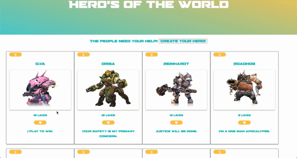
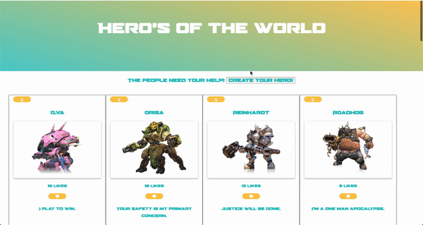
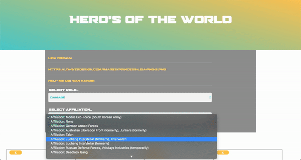
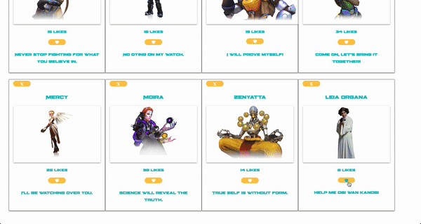

<h1 align="center">Heroes of the World</h1>

A `Javascript` application that allows people to create their own hero to help Overwatch end the Omni Crisis!

## Technologies
This web app makes use of the following technologies:

**Frontend**
- Vanilla Javascript
- Customized CSS3 styling

**Backend**
- Ruby [2.6.1]
- Rails [~> 6.0.2, >= 6.0.2.1] - MVC web framework used as an API
- Rack-cors - Handles Cross-Origin Resource Sharing (CORS), which makes cross-origin AJAX possible
- Bootsnap [>= 1.4.2]
- PostgreSQL [>= 0.18, < 2.0] - Database
- Active Model Serializers

## Prerequistes
Before you continue, please make sure you have installed the latest version of:

- Ruby
- Ruby on Rails
- PostgreSQL
- Javascript

## Launch
To launch this application, you'll have to follow these steps:

**Backend Installation**
- Clone [this repo](https://github.com/rlc900/heros_of_the_world.git) in your computers terminal.
- `cd` into that directory and open it in your text editor.
- Make sure PostgreSQL is running on your machine.
- Once your editor opens, `cd` into HeroesOfTheWorldApi and run:
  - `bundle install` to install the required dependencies.
  - Run `rails db:create` to create a database locally.
  - Run `rails db:migrate` to create tables into the database.
  - Run `rails db:seed` to create seed data.
  - Run `rails s` to run the server.

**Frontend Installation**

- Open up another terminal in `heroes_of_the_world` directory and run: 
  - `npm install` to install all dependencies.
  - `npm start` to start server.
  - Once you're taken to the web app, ensure Frontend is running at http://localhost:3000.
  
 ## Features
The main page displays all category's of Overwatch's heroes.

When a heroes playercard is clicked, more stats about them are shown!

To create a hero, simply click the 'Create New Hero' button and fill out the required fields.

Once you filled out the form and click 'Create', your hero will be displayed at the bottom of the page!

The user could also like and delete their playercard.

